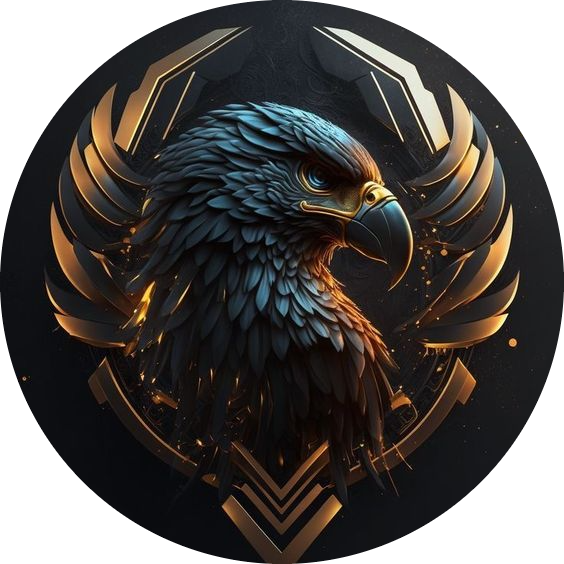

## International Developers Association's Server Warden
### Custom open-source Discord bot for my private Discord server


<div align="center">
    <h3>Creator</h3>
    <hr>
    
    <h3>Discord Server</h3>
    <hr>
    
    <h3>Server Warden</h3>
    <hr>
    
</div>

## Installation & Usage

Clone with SSH or HTTPS
```shell
git clone git@gitlab.com:discord-ida/server-warden.git
git clone https://gitlab.com/discord-ida/server-warden.git
```
Restore packages
```shell
dotnet restore ./DiscordBot
```
Modify `App.config` to match your configurations. <br>
Run with dotnet.
```shell
dotnet run ./DiscordBot/src/ConsoleApp/ConsoleApp.csproj
```

[//]: # (## Support - Maybe in the future - just a side-note)

## Roadmap
Planned / Integrated commands:

- [X] Insitux API
- [X] Server-Backup-Sys
- [X] Server-Restore-Sys
- [ ] Approved-Under-Hood System

###### Backup-Sys Includes

- Roles
- Categories & Channels + their corresponding role overwrites
- User assigned roles

## Contributing
If you wish to contribute you can inherit from one of those interfaces, <br>
which predefine the command structure. <br>

##### [Interfaces path](../Application/Interfaces): `Application > Interfaces` <br>
Command entry point: `ExecuteAsync(command)`
##### [Command store path](../Application/BotCommands): `Application > BotCommands`

> Everybody can contribute to this project, if they follow the major guidelines
- Use common code structure principles of C# (we may request to restructure your code)
- Use [Google's Styling Guide](https://google.github.io/styleguide/csharp-style.html)
- For common practises refer to [Discord.Net's Documentation](https://discordnet.dev/guides/introduction/intro.html)
- Maintain the SOLID principles
- Follow the Clean Architecture

## Authors and acknowledgment

Bot created by [Venen Jean](https://gitlab.com/VenenJean). <br>
Special gratitude to [MsZoeyZo](https://github.com/mszoezo) for her mentoring in code structure. <br>
Also to all contributors!

## [License](LICENSE)
```
      GNU GENERAL PUBLIC LICENSE Version 3, 29 June 2007
Copyright (C) 2007 Free Software Foundation, Inc. <https://fsf.org/>
```

## Project status
The project is being maintained by Venen Jean only, for now. <br>
The bot isn't permanently hosted, yet.
